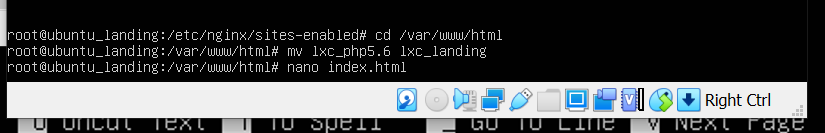

# Server Administration System Practicum
Abdul Muhaimin Nurdin (1202199001)

Abdillah Ainur Ridla (1202190060)

1. Rename Ubuntu

    - Displays available containers
    - Rename Ubuntu_php5.6 to Ubuntu_landing
    - Then check again if it works

    
    - Go to nano /etc/network/interfaces on Ubuntu_landing
    - Change ip to 10.0.3.103

    
    - Do a reboot, then check the IP whether it has been changed or not

    
    - setting nginx with the following hint:
        
        seting nginx

            cd /etc/nginx/sites-available
            mv lxc_php5.6.dev lxc_landing.dev
            nano lxc_landing.dev
            cd ../sites-enabled
            ln -s /etc/nginx/sites-available/lxc_landing.dev .
            nginx -t
            nginx -s reload
            nano /etc/hosts
            cd /var/www/html
            mv lxc_php5.6 lxc_landing
            nano index.html

    

    

    

    

2. Install lxc debian 9 with the name debian_php5.6

    

3. Start debian_php5.6 and go to debian_php5.6

    

    - Then install nginx on debian_php5.6

    

    

    - IP settings with the following hint

            apt install nano net-tools curl
            nano /etc/network/interfaces
            ubah ip 10.0.3.102
            systemctl restart networking.service
            ifconfig

    

    

    

    

    - Setting nginx with the following hint

            cd /etc/nginx/sites-available
            nano lxc_php5.6.dev 
            cd ../sites-enabled
            ln -s /etc/nginx/sites-available/lxc_php5.6.dev .
            nginx -t
            nginx -s reload
            nano /etc/hosts
            cd /var/www/html
            mv lxc_php5.6 lxc_landing
            nano index.html
    
    

    

    

    

    

    

        curl -i http://lxc_php5.dev
    
    

    - Exit dari debian_php5.6

    

4. Enter Ubuntu_landing with the following hint

        sudo lxc-attach -n ubuntu_landing
        cd /etc/nginx/sites-available
        mv lxc_php5.6.dev lxc_landing.dev
        nano lxc_landing.dev
        cd ../sites-enabled
        ln -s /etc/nginx/sites-available/lxc_landing.dev .
        nginx -t
        nginx -s reload
        nano /etc/hosts
        cd /var/www/html
        mv lxc_php5.6 lxc_landing
        nano index.html
        curl -i http://lxc_php5.dev/
        exit

    

        nano lxc_landing.dev

    

    

        nano /etc/host ubah ke lxc_landing.dev

    

    

        nano lxc_landing/index.html

    

    - test with curl

            curl –i http://lxc_landing.dev

    

5. Turn off ubuntu landing then enable auto start

        sudo lxc-stop –n ubuntu_landing

    

6.	setup nginx on vm.local to set proxy_pass where :

    - accessing http://vm.local will be redirected to  http://lxc_landing.dev
    - accessing http://vm.local/blog will be redirected to  http://lxc_php7.dev
    - accessing http://vm.local/app will redirect to http://lxc_php5.dev

    with the following hint

            sudo nano /etc/hosts
            cd /etc/nginx/sites-available
            sudo nano vm.local
            sudo nginx -t
            sudo nginx -s reload
            curl -i http://vm.local/

    

    

    

    

7. accessing http://vm.local will be redirected to http://lxc_landing.dev

    

    - accessing http://vm.local/app will be redirected to http://lxc_php5.dev

    

    - accessing http://vm.local/blog will be redirected to http://lxc_php7.dev

    

8. Analysis

    - **Why for the needs of php5.6 can not use ubuntu 16.04, so it needs to change the os to debian 9?**

            Because on Ubuntu 16.04 there was a change in the php package to 7.0 with the renewal facility structure which caused php5.6 to not be able to use Ubuntu 16.04 and needed to be changed to debian9 OS

    - **Why use LXC virtualization on the website schema that will be developed?**

            LXC is an operating system level virtualization method for running multiple isolated Linux systems called containers on a single control host. Because LXC can be used to isolate other services or processes from the host even though the isolation is not always perfect. However it provides its own virtual environment which has its own processes and network space.

    - **What is a proxy server? why can we think of vm.local as a proxy server?**

            Understanding Proxy Server is a computer server that provides services to forward user requests to other servers on the internet. With this, a computer can be connected to other computers via the internet. Vm.local can be considered as a proxy server because it acts as an intermediary between the client hosts and the server they want to access. when typing the URL address from Google, the computer will immediately send a request, but not directly to Google's server computer. But to a computer that acts as a proxy server. And when it receives the request, the proxy server then proceeds to Google's server computer. And vice versa, from Google servers to proxy servers, then to your computer. Proxies are created with the aim of retrieving, carrying, and delivering, then returning each request from the client, then storing the request in a place called cache (temporary storage). That way, traffic, network traffic, and waiting time will be more efficient, faster, and shorter when accessing them.

    

    

